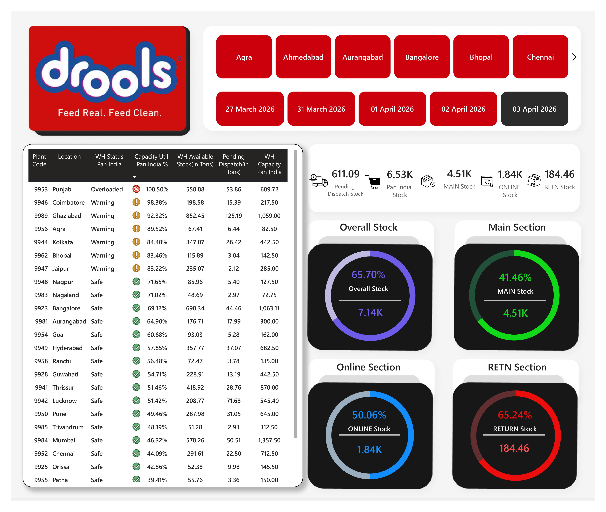
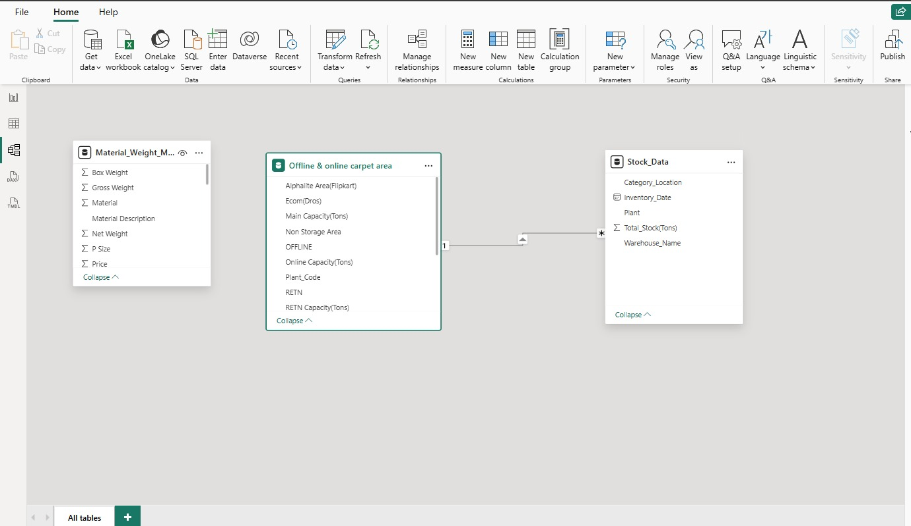

# 🏭 Warehouse Capacity Utilization Dashboard
Power BI solution to monitor warehouse capacity utilization using SAP MB52 data with folder-based ingestion and DAX-driven KPI analytics.

## 📊 Project Overview

This Power BI dashboard monitors warehouse capacity utilization using daily SAP MB52 inventory data.  
The solution enables tracking of stock levels, capacity usage percentage, and identification of overloaded warehouses.

The dashboard is designed using a scalable folder-based ingestion approach, making it suitable for daily operational reporting.

---

## 🚀 Key Features

- 📂 Folder-based automatic data ingestion
- 📅 Daily inventory tracking
- 📈 Capacity Utilization %
- 🚨 Overloaded warehouse identification
- 🎯 KPI summary cards
- 🟢 Traffic light conditional formatting
- 🔍 Date & warehouse level filtering
- ⭐ Clean star schema data model

---

## 🛠 Tools & Technologies Used

- Microsoft Power BI
- DAX (Data Analysis Expressions)
- Power Query (ETL)
- Folder-based data ingestion
- Excel (SAP MB52 export simulation)

---

## 🧠 Core DAX Measures

- **Total Stock MT**
- **Max Capacity MT**
- **Capacity Util %**
- **Warehouse Status (Overloaded / Warning / Safe)**
- **Overloaded Count**
- **Total Network Capacity**

---

## 🗂 Project Structure
```

warehouse-capacity-dashboard/
│
├── Warehouse_Capacity_Dashboard.pbix
├── Sample_Data/
│   └── Stock_Sample.xlsx
├── screenshots/
│   ├── dashboard.jpeg
│   └── datamodel_view.jpeg
└── README.md
```
---
## 📷 Dashboard Preview





---

## 📌 Business Logic

Capacity Utilization % =  
Total Stock MT ÷ Max Capacity MT

Status Classification:
- >100% → Overloaded
- 90–100% → Warning
- <70% → Safe

---

## 🔄 Daily Refresh Process

1. Export MB52 from SAP
2. Save file in Raw Data folder
3. Open Power BI file
4. Click Refresh
5. Review Overloaded warehouses

---

## 📚 Learning Outcomes

- Implemented Star Schema modeling
- Applied DAX measures with context handling
- Managed row-level vs total-level calculations
- Built automated folder ingestion pipeline
- Designed management-ready KPI dashboard

---

## ⚠ Disclaimer

This project uses sample data for demonstration purposes only.  
No confidential or real business data is included.

---

## 📬 Connect With Me

If you found this project useful, feel free to connect or reach out.
